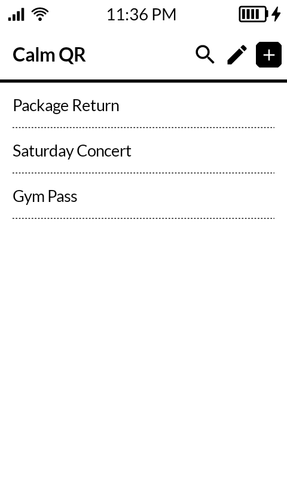
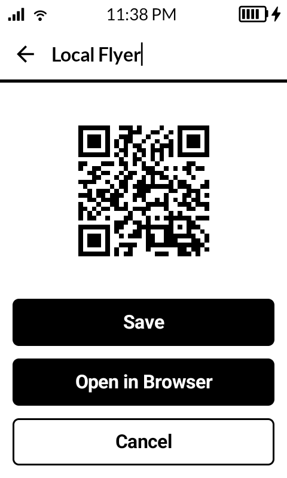
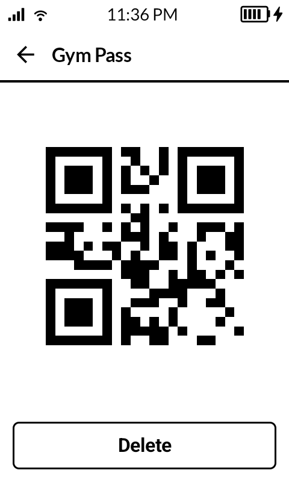
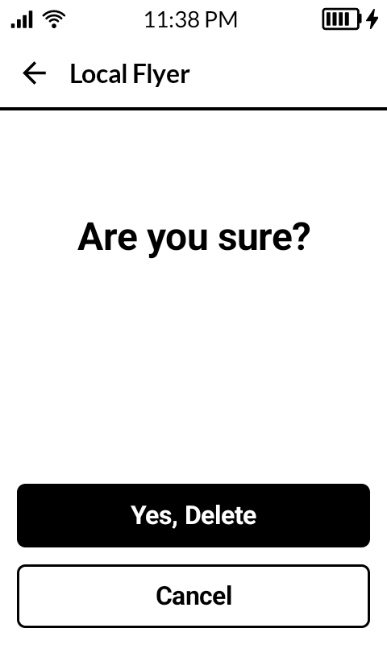
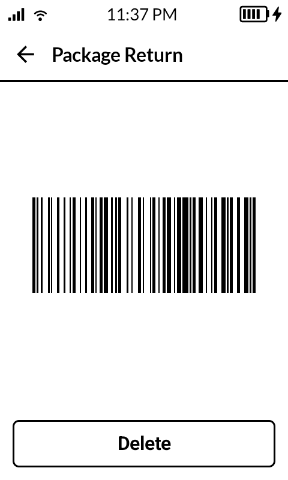
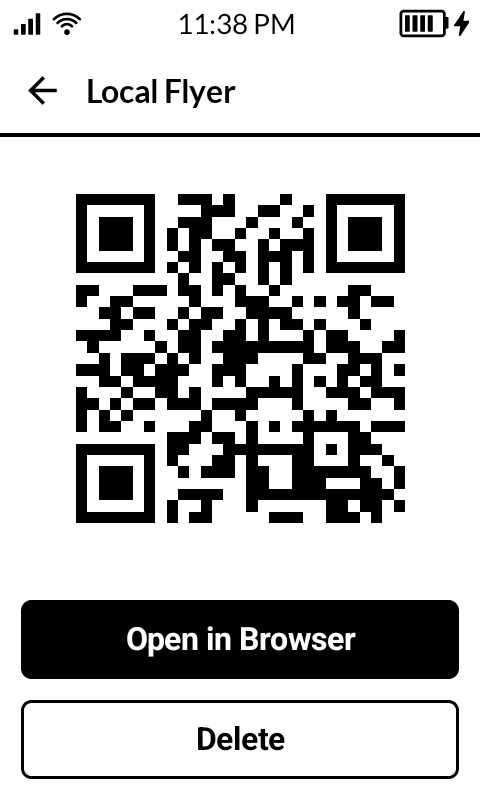
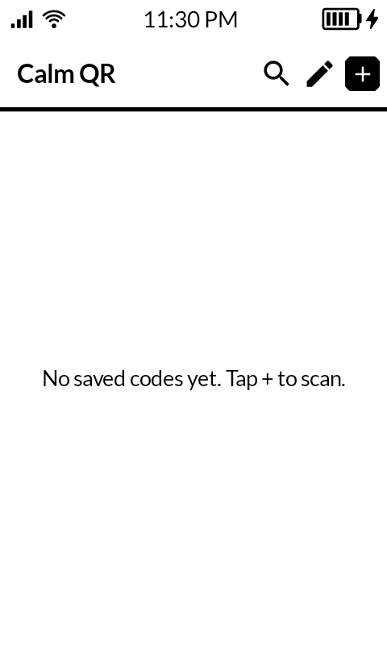

<a href="https://buymeacoffee.com/jacobmoss" target="_blank">
  
</a>

<br clear="all" />

# Calm QR

**Calm QR** is a minimal, calm barcode & QR code scanner and storage built for the **Mudita Kompakt**.

The interface and philosophy aspires to follow that of [Mudita Mindful Design](https://mudita.com/community/blog/introducing-mudita-mindful-design/).

---

## Background
I've been living with my **Mudita Kompakt** for a little while now, and one of the pain points I keep encountering is simply needing to have QR codes -- to scan and to keep for tickets, returns, etc.

I found some open source QR scanning apps (it's a fairly rudimentary thing) but they just all felt clunky on the Kompakt. I've scraped this little thing together to hopefully solve that pain point for myself and others as well.


## Screenshots

| Home | Scan Result | Saved Code | Delete Confirm |
|---|---|---|---|
|  |  |  |  |

| Barcode | Browser Link | Empty Home |
|---|---|---|
|  |  |  |

---

## Features

- **Scan QR codes & barcodes** — powered by CameraX + Rust (rxing)
- **Save & manage scans** — persisted locally with Room
- **Open links directly** — tap to launch URLs in the browser
- **E-ink optimized UI** — built with Mudita Mindful Design (MMD) components
- **Fully offline** — no network permissions, no analytics, no trackers

---

## Supported Formats

QR Code, Code 128, Code 39, Code 93, EAN-13, EAN-8, UPC-A, UPC-E, ITF, Codabar, PDF 417, Aztec, Data Matrix

---

## Tech Stack

- **Language:** Kotlin + Rust
- **UI:** Jetpack Compose with Mudita MMD
- **Barcode Engine:** [rxing](https://github.com/rxing-core/rxing) (Rust, via JNI)
- **Camera:** CameraX
- **Database:** Room
- **Min SDK:** 28 · **Target SDK:** 35

---

## Building

```bash
# Debug
./gradlew assembleDebug

# Release (requires signing config in app/local.properties)
./gradlew assembleRelease
```

Rust cross-compilation targets are required:

```bash
rustup target add aarch64-linux-android armv7-linux-androideabi
```

## Known Issues
It's not perfect, and I've thrown it together quickly. Here are some of the things I'm thinking about it.
### Barcode scanning is not as reliable
I decided to add in barcode scanning to replace that dreaded "I just need to scan the __ sent to your email" which doesn't really work so well when you don't carry around your email. Often those are QR codes, sometimes barcodes. I've found the barcode scanning isn't as reliable, and my attempts to improve it haven't done too much. Be sure when scanning in a barcode that it looks like the barcode you scanned. If it is overly simplified there's a good chance it was done incorrectly.

A little note: I do have an optional screen overlay to reduce the camera area during the 'Scanning' mode, but often if you're struggling to scan a barcode removing it tends to have better results.
### QR code images change
The underlying data has been consistent in my testing, however, the library and methods I've used generate new QR code images most of the time than the exact one that is input. This should be fine since the format allows for this variance, but it's something to keep in mind.
### Under-tested in real life
I've just started using it myself, so I can't say that it works well in all scenarios. Use with care and caution and have back up images just in case.
### Flashing for the codes
I added a full screen flash before displaying the codes -- this is to clean up the ghosting on the e-ink screen as we prepare the codes to be scanned. I quite like the result, however, I do worry for those who might be sensitive to screens flashing (even when that flash is not accompanied by direct light beams). I just want you to be aware if this is you.

---

## License

Licensed under the Apache License, Version 2.0. See [LICENSE](LICENSE) for details.

---

**Built with mindfulness for a calmer digital experience.**
